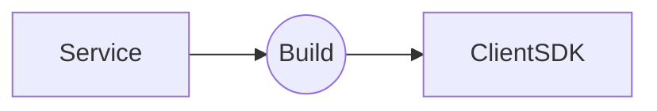

# AWS Microservice Framework（仮）

[Service(./service/src/actions)](./service/src/actions) の実装から [Client SDK(./service-client/src/actions)](./service-client/src/actions) の実装を自動生成してAWSでのマイクロサービス制作を簡単にするツールです。



- **Client SDK** は GitHub Packagesd などのレジストリに登録してシェアして下さい。
- **Client SDK** はローカルからのオペレーションやアプリケーション側のAPI内にインストールして使用します。

## Commands

### Build

Service に実装した各種アクションからClient SDK を自動生成します。

```bash
npm run build
```
