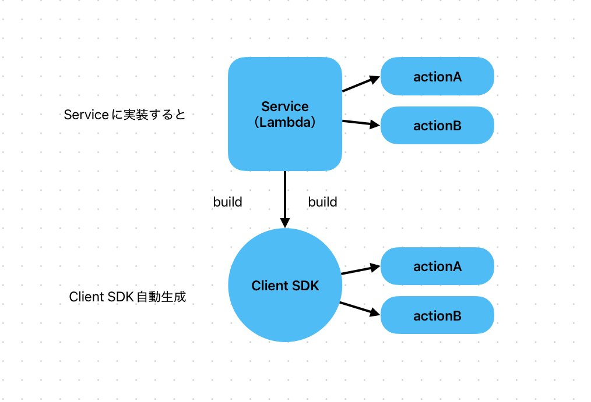
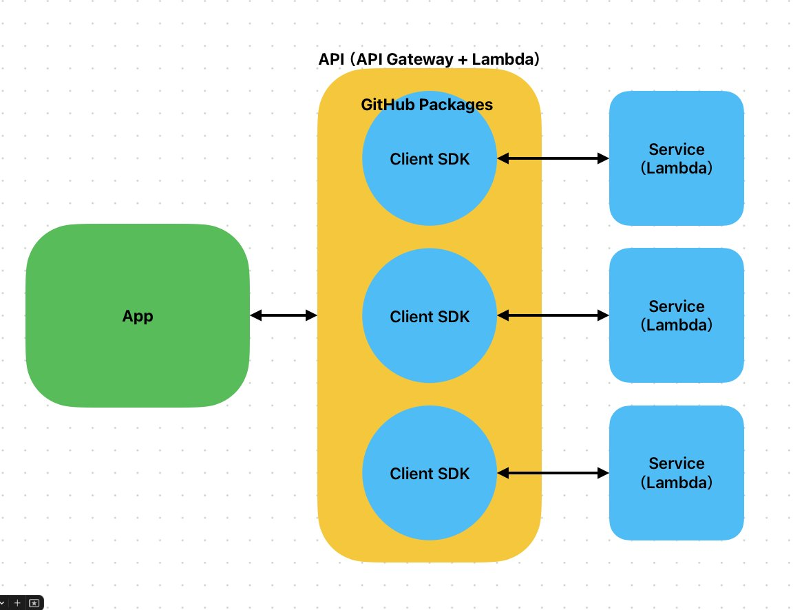

# AWS Microservice Framework（仮）


[](https://github.com/xojs/xo)

> [📡 Twitchライブ（期間限定)](https://www.twitch.tv/videos/2560384073)

[Service](./service-gateway/src/actions) の実装から [Client SDK](./service-client/src/actions) の実装を自動生成してAWSでのマイクロサービス制作を簡単にするツールです。

**全体図**


**配置イメージ**


- **Client SDK** は GitHub Packagesd などのレジストリに登録してシェアして下さい。
- **Client SDK** はローカルからのオペレーションやアプリケーション側のAPI内にインストールして使用します。


## アクション仕様

- [アクション仕様はこちら](./docs/actions.md)

## 実装方法

1. ```node service make action {アクション名}``` でアクションを生成します。
2. ①で生成したアクション [./service-gateway/src/actions/{アクション名}/index.js](./service-gateway/src/actions) を実装します。
3. ```sam build && sam deploy``` でAWSにデプロイします。
4. ```node service build sdk``` で [ServiceClient](./service-client) ビルドします。
5. [ServiceClient](./service-client) を GitHub Packages などにパブリッシュしてシェアして下さい。


## コマンド

### Make Action

Service に新しいアクションを追加します。

```bash
node service make action
```

### Make ENV

sam build -u を行う際に必要な 環境変ファイル ```env.json``` を生成します。

```bash
node service make env
```

### Build SDK

Service に実装した各種アクションからClient SDK を自動生成します。

```bash
node service build sdk
```

### Build Docs

Service に実装した各種アクションのドキュメントファイルを生成します。

```bash
node service build docs
```


## XOコーディングスタイル制限

 > [XO](https://github.com/xojs/xo)

> xo は ESLint で必要なものを詰め合わせた Linter & Formatter です。（VSCode拡張の併用推奨）

### ファイル名は kebab-case で作成

Gitではファイル名の大文字小文字を認識できないため kebab-kase で作成します。

### 関数名は camelCase で作成

一般的な camelCase で関数を作成して下さい。

### Tabインデント

Tabが気持ち悪い場合は公式サイトにならって packlage.json に変更を適用できます。

経験上、2 Space でのインデントは雑な編集者によりとろこどころ 3 Space になっていたりしたことがあり、XOデフォルトの Tab Space にアドバンテージがあると感じています。
